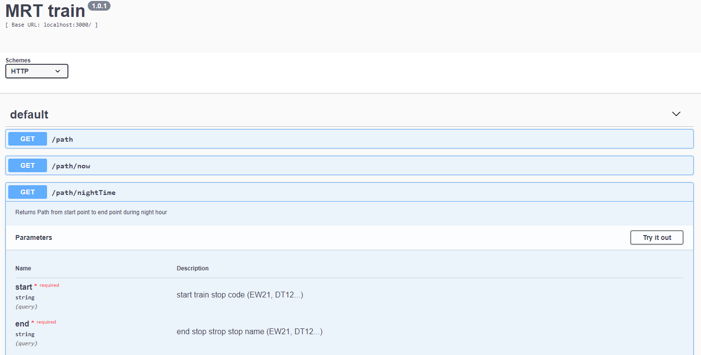

MRT PATH finding api
----

# Approach
To provide a MRT itenary based on an .csv file that represent the MRT maps, I choose Dijkstra’s Algorithm. Many step are required before running the algorithm.

Frist we will need a map that represents the MRT.

## Weighted Graph

The MRT stops on the map are the nodes of the graph, the paths between them are the edges, and the time to get from any one node to the other is the weight of each edge.
The graph can be represented by an adjacency list. Each node in the adjacency list points to an array of neighboring nodes, the endpoint of every edge extending from that node. In a weighted graph, the adjacency list carries a other piece of informations: the weight of each edge, an array of values that represents the cost of getting to that particular node based on various condition (night time, peak hours...).
We will also store more informatio of the MRT stops (code name, opening date).

```javacript
class Graph {
  constructor() {
    this.nodes = [];
    this.adjacencyList = {};
  }
```

While parsing the .csv we will build our graph at the same time. In the following example, the MRT stop have list of adjacency nodes, here "Bukit Badok", all the other information are store for performing our path finding algorithm.


```javacript
"Jurong East": [
      {
        "originCode": "NS1",
        "originOpeningDate": "1990-03-09T23:00:00.000Z",
        "node": "Bukit Batok",
        "destinationOpeningDate": "1990-03-09T23:00:00.000Z",
        "destinationCode": "NS2",
        "weight": {
          "peakHour": 12,
          "nonPeakHour": 10,
          "nightTime": 10,
          "default": 1
        }
      },
```

Once the graph is build, we will serialized all the information and save it in a .JSON format file. Therefore we won't need to parse and rebuilt the entire graph each time we are running the project, we can will simply load the file and deserialized it to get our weighted Grapth.

To reproduce it, run the following command


        npm run build:graph

The code for the building the graph can be found at 'src/service/graph/index.js'

## Dijkstra’s Algorithm

The algorithm explanation : https://en.wikipedia.org/wiki/Dijkstra%27s_algorithm

In our MRT station case, while performing the path finding, we also need to take in consideration the current date and time to determine if there is a connection between 2 nodes. No connection when weight=0 (during night time traffic) or when the openingDate is not reached yet.


# Installation
## 1. Requirement

I have developped & tested the application with:

- Windows 10 Ubuntu 16. bash
- Node 8.9
- Npm 5
- Docker for Windows version 17.09.1-ce

## 2. Usage

1.  run the follow command to install all dependencies, external lib list can be found in the file 'package.json'

        npm install

2. Documentation and API description using swagger
run

        npm start

    open your browser and go to 'http://localhost:3000/docs/v1/'.

    You should see the following, click on the different API and try it




3. API end points


**Description** : Returns Path from start point to end point
**URL** : `/path`
**Method** : `GET`
**Query** :  ?start=START_STATION_CODE &end=END_STATION_CODE &startAt=YYYY-MM-DDThh:mm
Note : startAt is optional.

**Description** : Returns Path from start point to end point at the current time
**URL** : `/path/now`
**Method** : `GET`
**Query** :  ?start=START_STATION_CODE&end=END_STATION_CODE


**Description** : Returns Path from start point to end point during nightime||peak hour || non peak jour
**URL** : ` /path/nightTime ||  /path/peakHour || /path/nonPeakHour`
**Method** : `GET`
**Query** :  ?start=START_STATION_CODE&end=END_STATION_CODE

Example
```
http://localhost:3000/path/?start=EW20&end=DT12&startAt=2019-05-24T01:00
```

4. With Docker
```
#Build the image
$ docker build -t <app-name> .
#Run image
$ docker run -p 3000:3000 <app-name>
```

## 3. Tests

In the application directory run the follow command:

	npm run test

I used javascript testing library mocha and chai for my unit test, the test files are located in /src/tests

## 4. Potential application design improvements


- Use A* algorithm, with more data on the MRT, we could have a proper heuristic function.
- Caching most requested traffic requests for a better scalability. 
- In case the MRT map expanding, use http polling to overcome this deficiency.


